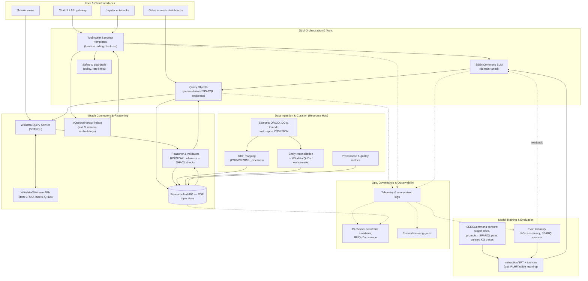

# SEEKCommons SLM Stack

## Embedding the CARE Principles—**Collective Benefit, Authority to Control, Responsibility, and Ethics**—into the SEEKCommons SLM stack

Components are referenced by their diagram labels (e.g., **QOBJ**, **RHKG**, **Reasoner**, **SEC**, etc.), and concrete actions, policies, and short scenarios are given.

---

## 1) Collective Benefit

**Where in the diagram:** *User & Client Interfaces (A), SLM Orchestration & Tools (B), Graph Connectors & Reasoning (C), Data Ingestion & Curation (D), Training/Eval (E), Ops/Governance (F).*

**Design choices & actions**

* **Co‑define “benefit questions” and bake them into QOBJ.**
  Run a short, recurring co‑design step where the community nominates the top questions they want answered (e.g., “Which network fellows collaborate across topic X?”). Implement each as a **parameterized Query Object (QOBJ)** with friendly inputs (e.g., topic, date range), publish it as a reusable endpoint, and surface it in **Gala dashboards** and **Scholia views** so non‑experts immediately get value. This mirrors the workshop plan to “capture the top 5 questions… then show SPARQL in practice,” and the later demo pattern of shareable query endpoints. 
* **Make “return of benefit” a default in pipelines.**
  For any reconciliation or curation you do (e.g., **RECON → RHKG**), configure a reverse flow: when you fix or enrich entities locally (labels, ORCID, DOIs), propose those improvements upstream to **Wikidata/Wikibase (WBAPI)** with provenance. This ensures community knowledge returns to the commons rather than remaining siloed in **RHKG**. 
* **Design for explainable, community‑navigable knowledge.**
  Use **Scholia** profiles and **Gala** no‑code dashboards to present outputs from **WDQS/QOBJ** in ways that communities can browse, cite, and reuse—supporting learning, coordination, and discovery across institutions without forcing everyone to learn SPARQL. 
* **Human‑in‑the‑loop ideation at the edges.**
  Encourage participatory “question brainstorming” in **UI / Notebooks** and treat the SLM as a facilitative partner (e.g., proposing filters, clarifying entity scope), before delegating to deterministic tools (**QOBJ→WDQS/Reasoner**). This aligns with the “always‑available brainstorming partner” posture for AI‑assisted problem solving. 

**Policies**

* Publish a small catalog of “community‑approved queries” in a **QOBJ registry** with tags (benefit type, target audience, refresh cadence), and require that new endpoints document how they serve a shared benefit (e.g., discovery, reproducibility, collaboration).
* Set **benefit KPIs** in **EVAL** (e.g., % of users served by top‑5 question endpoints; number of upstream contributions back to Wikidata per quarter) and show them in **Gala**.

**Example scenario**

* Fellows vote that “grant outputs by topic and repository” is a top need. You ship `qobj/grants_by_topic?topic=…&repo=…`, visualize it in **Gala**, and upstream any missing identifiers discovered during reconciliation to Wikidata with provenance. 

---

## 2) Authority to Control

**Where in the diagram:** *Data Ingestion & Curation (D), Orchestration (B), Governance (F).*

**Design choices & actions**

* **Subject‑managed identity and claims.**
  Treat **ORCID** as the primary, self‑managed identity source for people. During ingestion (**SOURCES → RECON → RHKG**), privilege data that authors control (ORCID works, DOIs, Zenodo records) and record that provenance explicitly (**PROV**). This follows the team’s practice of “start with ORCID, then map into Wikidata,” giving individuals a clear path to curate their own records. 
* **Consent‑aware QOBJ and access control.**
  Add a “consent/visibility filter” to **QOBJ** so queries can automatically exclude records flagged as restricted by subjects or communities (e.g., `?consent_status IN ('public','aggregate_only')`). Enforce these checks in the **Router → Guard** path so they cannot be bypassed by calling the SPARQL endpoint directly. 
* **Editable representations and upstream corrections.**
  Provide an “Edit/Dispute” link beside every **UI/Scholia/Gala** view that opens a guided correction flow:

  1. Propose a change to **RHKG** (staging).
  2. If the source is Wikidata, open a templated **WBAPI** patch (labels, statements) with references.
  3. On merge, **PROV** stores who changed what and why, and **CI** verifies constraint compliance. This respects contributors’ authority to shape their representation. 
* **Community‑scoped governance modes.**
  Permit communities to declare policy modes (e.g., “aggregate‑only output for sensitive topics”) in **SEC** and tag relevant resources/entities. The **Router/Guard** reads those tags to force aggregation or deny disallowed joins.

**Policies**

* A **Representation & Consent Policy** that: (a) prefers subject‑managed sources (ORCID/Zenodo); (b) documents data provenance and license; (c) supports removal/aggregation requests with auditable outcomes; and (d) explains escalation paths for disputes. 

**Example scenario**

* A fellow requests that pre‑publication work be shown only in aggregate. An admin sets `visibility=aggregate_only` on the item; **QOBJ** filters respect it; **Gala** shows counts/trends without exposing item‑level details; a Wikidata patch is postponed until publication. 

---

## 3) Responsibility

**Where in the diagram:** *Reasoner & validators (C), Training/Eval (E), Ops/Governance (F), Guard (B).*

**Design choices & actions**

* **Deterministic validation before exposure.**
  Enforce **RDFS/OWL‑aware** typing and **SHACL** constraint checks in **Reasoner & validators** for every ingestion batch and before publishing new **QOBJ** endpoints. Typical shapes:

  * `wdt:P50 (author) → orcid:ID required` for named‑author outputs where applicable
  * Cardinality limits for project managers
  * Disjointness constraints (Person vs Organization)
    Violations are surfaced to **CI** and block deployment. This leverages the semantic layer for correctness, not just convenience.
* **Evidence‑first retrieval and explanation.**
  Keep **prompt↔SPARQL pairs and KG traces** in **CORP** so the SLM can cite the exact triples and queries used. Inference (subclasses, transitivity) is computed by the **Reasoner** and echoed back in explanations (“Why this result?”) with links to **Scholia** or item pages. 
* **Guardrails for safe, fair, and reliable operation.**
  Configure **Guard** with:

  * **Rate limits/backoff** for WDQS; graceful degradation to cached **QOBJ** results.
  * **Join limits** and **sensitive‑attribute blocks** (e.g., no ad‑hoc joins that could re‑identify individuals; force aggregate only).
  * **PII scrubbing/anonymized LOGS** by default; secure enclaves for limited diagnostic detail when explicitly authorized. 
* **Continuous evaluation with KG‑specific metrics.**
  Expand **EVAL** beyond generic accuracy to include SPARQL success rate, constraint‑violation rate post‑inference, upstream contribution counts, and delta in **IRI/Q‑ID coverage**—all reported in **Gala**. 

**Policies**

* A **Change‑Management SOP**: any new mapping (**MAP**), reconciliation (**RECON**), or QOBJ publishes a validation report (SHACL results, diffs, provenance) and a rollback plan.
* A **Usage Accountability Policy**: publish aggregate analytics (what endpoints are run, by whom at what role level, for what approved purpose), with opt‑outs and strict retention. 

**Example scenario**

* A new QOBJ that correlates grants, authors, and affiliations fails a SHACL rule (person also typed as organization). The **CI check** blocks release, the **Reasoner** pinpoints the conflicting triple, and a corrective **WBAPI** edit is proposed with references; deployment resumes after validation. 

---

## 4) Ethics

**Where in the diagram:** *SEC (privacy/licensing gates), PROV, LOGS, TRAIN/EVAL, Router/Guard.*

**Design choices & actions**

* **Licensing and provenance gates before use.**
  In **SEC**, codify allowed licenses and usage conditions; the **Router** blocks tool calls if inputs lack permissible licenses or provenance (e.g., no CC‑BY or compatible license → no enrichment or model‑training). Record **PROV** (source, retrieval date, license, consent) on every triple; show it in UI hovercards. This mirrors the workshop’s emphasis on provenance and licensing as governance tools. 
* **Bias & harm checks as first‑class evaluations.**
  Extend **EVAL** to include bias probes on common slices (by field, institution type, region) using deterministic graph queries plus targeted SLM prompts. Flag skew that arises from incomplete or uneven coverage (e.g., missing ORCIDs in certain groups) and convert findings into ingestion backlogs (**MAP/RECON** tasks). 
* **Prefer open, transparent models and local options.**
  Where stakeholders object to cloud AI, support **local SLM inference** (on‑prem via **Router → SLM**) while maintaining identical guardrails and audit trails. This option was explicitly discussed as a way to address AI skepticism. 
* **Semantics‑led explainability to curb overreach.**
  Make the **Reasoner** the arbiter of what is *provable* (vs. what the SLM merely infers). The UI labels answers as “proven by KG inference” or “model suggestion—review required,” and blocks model‑only assertions in regulated views. This leverages the RDFS/OWL layer for trustworthy, logically grounded explanations. 
* **Standards for federation to avoid lock‑in ethics traps.**
  Keep the integration tier RDF‑first (IRIs, SPARQL, SHACL) so partners can participate on equal footing, avoiding power asymmetries created by proprietary schemas. This is consistent with the argument that standards enable equitable federation and reduce reinvention. 

**Policies**

* A **Public Modeling Notes** site that documents entity schemas, SHACL shapes, rationale for property choices, and known limitations—so communities can contest or improve the model.
* A **Risk Register & Mitigation Plan** (privacy, bias, sustainability, over‑reliance on black‑box AI) maintained in Ops, reviewed quarterly, and visible to participants. 

**Example scenario**

* Before adding an affiliation‑topic correlation QOBJ to Gala, **SEC** confirms source licenses, **EVAL** runs bias checks (coverage by region), and **PROV** is surfaced in the UI. The view ships with a warning if the shape of the data may mislead (e.g., “ORCID coverage is low for institution class X—interpret with caution”). 

---

### Quick implementation checklist (mapped to components)

* **QOBJ:** add `consent/visibility` filters; publish a curated registry with “benefit tags”; enforce license checks pre‑execution. 
* **Reasoner/SHACL:** maintain shapes for key classes; gate releases on CI validation; store inference proofs for UI explanations. 
* **SEC/Guard:** configure rate limits, join limits, sensitive‑attribute rules; block non‑compliant licenses; support local SLM mode.
* **PROV:** capture source, license, consent, and edit history; show provenance badges in UI; include in exports. 
* **EVAL/LOGS:** track SPARQL success, constraint violations, bias slices, upstream contributions; anonymize logs by default; publish benefit KPIs in Gala. 
* **Training (CORP/SLM):** keep prompt↔SPARQL pairs and KG traces; label outputs as “proven” vs “suggested”; prefer semantic grounding to reduce hallucination. 
