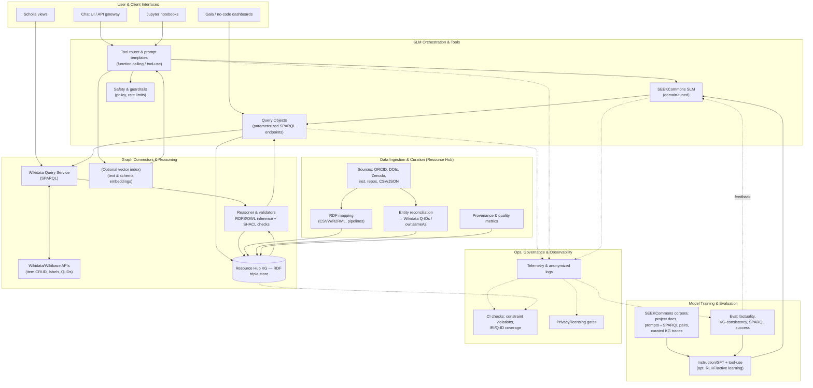

```mermaid
flowchart TB
  %% LAYOUT
  %% --- User & Client Interfaces ---
  subgraph A[User & Client Interfaces]
    UI[Chat UI / API gateway]
    NB[Jupyter notebooks]
    SCHO[Scholia views]
    GALA[Gala / no‑code dashboards]
  end

  %% --- SLM Orchestration & Tools ---
  subgraph B[SLM Orchestration & Tools]
    Router["Tool router &amp; prompt templates<br/>(function calling / tool-use)"]
    SLM["SEEKCommons SLM<br/>(domain-tuned)"]
    QOBJ["Query Objects<br/>(parameterized SPARQL endpoints)"]
    Guard["Safety &amp; guardrails<br/>(policy, rate limits)"]
  end

  %% --- KG Connectors & Reasoning ---
  subgraph C[Graph Connectors & Reasoning]
    WDQS["Wikidata Query Service<br/>(SPARQL)"]
    WBAPI["Wikidata/Wikibase APIs<br/>(item CRUD, labels, Q-IDs)"]
    RHKG[(Resource Hub KG — RDF triple store)]
    Reasoner["Reasoner &amp; validators<br/>RDFS/OWL inference + SHACL checks"]
    VEC["(Optional vector index)<br/>(text &amp; schema embeddings)"]
  end

  %% --- Data Ingestion & Curation ---
  subgraph D["Data Ingestion &amp; Curation (Resource Hub)"]
    SOURCES["Sources: ORCID, DOIs, Zenodo,<br/>inst. repos, CSV/JSON"]
    MAP["RDF mapping<br/>(CSVW/R2RML, pipelines)"]
    RECON[Entity reconciliation\n→ Wikidata Q‑IDs / owl:sameAs]
    PROV[Provenance & quality metrics]
  end

  %% --- Training / Evaluation Pipeline ---
  subgraph E[Model Training & Evaluation]
    CORP[SEEKCommons corpora:\nproject docs, prompts↔SPARQL pairs,\ncurated KG traces]
    TRAIN["Instruction/SFT + tool-use<br/>(opt. RLHF/active learning)"]
    EVAL[Eval: factuality,\nKG-consistency, SPARQL success]
  end

  %% --- Ops & Governance ---
  subgraph F[Ops, Governance & Observability]
    LOGS[Telemetry & anonymized logs]
    CI["CI checks: constraint violations,<br/>IRI/Q‑ID coverage"]
    SEC[Privacy/licensing gates]
  end

  %% FLOWS
  UI --> Router
  NB --> Router
  GALA --> QOBJ
  SCHO --> WDQS

  Router --> SLM
  Router --> Guard
  SLM --> QOBJ
  Router --> VEC
  VEC --> Router

  QOBJ --> WDQS
  QOBJ --> RHKG
  WDQS <---> WBAPI
  WDQS --> Reasoner
  RHKG --> Reasoner
  Reasoner --> QOBJ
  Reasoner --> RHKG

  SOURCES --> MAP --> RHKG
  SOURCES --> RECON --> RHKG
  PROV --> RHKG

  LOGS -.-> EVAL
  LOGS -.-> CI
  LOGS -.-> SEC
  RHKG -.-> CI
  QOBJ -.-> LOGS
  Router -.-> LOGS
  SLM -.-> LOGS

  CORP --> TRAIN --> SLM
  EVAL --> TRAIN
  EVAL -. feedback .-> SLM

```
